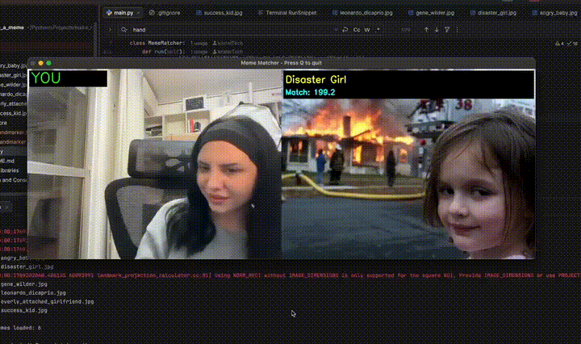

#  Meme Matcher - Real-time Facial Expression to Meme Matching

A real-time computer vision application that matches your facial expressions and hand gestures to famous internet memes using MediaPipe's face and hand detection.

##  What It Does

Point your webcam at yourself, make different facial expressions and hand gestures, and watch as the app finds the meme that best matches your expression in real-time! The matched meme appears side-by-side with your camera feed.

## Video Demo

[]

##  Features

- **Real-time Face Detection**: Uses MediaPipe Face Landmarker to track 478 facial landmarks
- **Hand Gesture Detection**: Tracks hand positions to distinguish similar expressions (e.g., Leo's cheers vs Disaster Girl's smirk)
- **Advanced Expression Analysis**:
  - Eye openness (surprise, wide eyes)
  - Eyebrow position (raised, furrowed)
  - Mouth shape (smiling, open, concerned)
  - Hand gestures (raised hands, fist pumps)
- **Smart Matching Algorithm**: Weighted similarity scoring with exponential decay for accurate matching
- **6 Iconic Memes**: Carefully selected for diverse expressions and high detection quality


##  Installation

### Prerequisites

- Python 3.11
- Webcam

### Setup

1. Clone the repository:
```bash
git clone 
cd make_me_a_meme
```

2. Install dependencies:
```bash
pip install mediapipe opencv-python numpy
```

3. Run the application:
```bash
python3 main.py
```

The first time you run it, the app will automatically download the required MediaPipe models (~7MB total).

## How to Use

1. Run `python3 main.py`
2. Your webcam will activate
3. Make different expressions and gestures:
   - **Angry face** → Angry Baby
   - **Smirk (no hands)** → Disaster Girl
   - **Smirk + hand on chin** → Gene Wilder
   - **Smile + raised hand** → Leonardo DiCaprio
   - **Wide eyes/staring** → Overly Attached Girlfriend
   - **Happy + fist pump** → Success Kid

4. Press **'q'** to quit

## How It Works

### 1. Face & Hand Detection
- Uses MediaPipe Face Landmarker (478 landmarks per face)
- Uses MediaPipe Hand Landmarker (21 landmarks per hand, up to 2 hands)
- Detects facial features and hand positions in real-time

### 2. Feature Extraction
For each frame, the app calculates:
- **Eye features**: Openness, symmetry
- **Eyebrow features**: Height, position relative to eyes
- **Mouth features**: Openness, width ratio, elevation
- **Hand features**: Number of hands, raised/lowered position
- **Expression scores**: Surprise, smile, concern, cheers

### 3. Similarity Matching
- Compares your features against pre-loaded meme features
- Uses weighted exponential decay scoring
- Higher weights for distinctive features (cheers score: 30 points, hand_raised: 25 points)
- Finds the best match and displays it alongside your video feed

##  Contributing

Feel free to:
- Add more memes (with hand gestures for better accuracy!)
- Improve the matching algorithm
- Enhance the UI
- Optimize performance

##  License

This project is for educational and entertainment purposes.

## Credits

- **MediaPipe**: Google's ML framework for face and hand detection
- **Meme Images**: Fair use, iconic internet memes
- **OpenCV**: Open source computer vision library

##  Future Improvements

- [ ] Add more memes (target: 10-15)
- [ ] GUI for meme selection
- [ ] Save matched screenshots
- [ ] Expression history/statistics
- [ ] Multiple face support
- [ ] Custom meme upload via UI
- [ ] Performance optimizations
- [ ] Mobile app version

---
